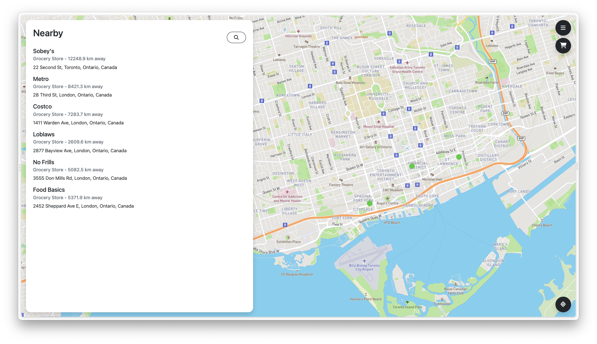

# BestBeFed

**Link to deployed app: <https://bestbefed.ca>**

- [Quick Overview](#quick-overview)
- [Description](#description)
- [Key Features](#key-features)
  - [Home Page](#home-page)
  - [Join Now / Signup Page](#join-now--signup-page)
  - [Login Page](#login-page)
  - [Cart Page](#cart-page)
  - [Available Stores Page (Main App Screen)](#available-stores-page-main-app-screen)
- [Instructions](#instructions)
- [Development Requirements](#development-requirements)
  - [Installing Dependencies](#installing-dependencies)
  - [Running Dev Server](#running-dev-server)
  - [Running Tests](#running-tests)
- [Deployment and Github Workflow](#deployment-and-github-workflow)
- [Licenses](#licenses)

## Quick Overview

Our goal for BestBeFed is to create an application that allows stores to reduce their food waste while also helping people in need. Our users fall into two main groups:

- Suppliers: grocery store owners, convenience store owners, bakery owners, etc.
- Consumers, which splits into two subcategories:
  - Organizations - food banks, food pantries, soup kitchens
  - Individuals - independent people or families/households in need of food

## Description

BestBeFed is a website that aims to help people in need find food at a very low cost. Firstly, our  application provides a platform where grocery and convenience stores (both large chains and individually-owned shops) can list all of their inventory that is getting closer to expiry, either at heavily discounted prices or for free. Furthermore, individual users or charitable organizations like food banks can make an account and then order items from stores of their choosing. There is no delivery feature in the application as of yet, however, users will be able to clearly see participating stores that are closest to them and order from there, and then pick up their items at a time of their choosing.

Through the development of this application, our team is trying to combat both large-scale waste of food and also food-insecurity at the local level. It is clear to see that our application has significant and direct benefits for both stores and end-users. Regarding stores that choose to participate, they will be able to cut losses by selling food for reduced prices that would normally just be thrown out; thus, they are reducing their environmental footprint while also improving their financial situation. Stores also benefit from the positive image that comes with giving back to their communities. The obvious benefit for consumers is that they will be able to find food items for very low prices (or free-of-charge), allowing them to meet their nutritional needs without needing to add to their own financial stress.

### Our Motivation for BestBeFed

Some of the recent jarring statistics surrounding food waste and insecurity in Canada help to contextualize the problem and illustrate the utility of BestBeFed. According to The Star, roughly 6 million Canadians exhibited some form of food insecurity in 2021 (often skipping meals or having to avoid buying certain important products), largely due to the shocking level at which inflation is being observed on food items ([source](https://www.thestar.com/business/opinion/2022/09/21/when-food-becomes-the-next-expense-you-have-to-cut)). In addition to this, studies have shown that roughly 4.82 million tonnes of food are wasted throughout the supply chain and sales of food, which grocers make up a large part of, typically due to throwing away expired inventory ([source](https://www.cbc.ca/news/canada/toronto/food-waste-report-second-harvest-1.4981728)) These are two enormous issues that the country faces at the moment, and our team saw an opportunity to help combat both at once.

## Key Features

### Home Page

- An initial landing page with a login and sign up button.
- Includes basic information: messages for clients (consumers) and grocery/convenience store owners that describe a basic introduction to our product
- Allows users to see participating stores without signing in

### Join Now / Signup Page

- Simple signup form
- Has username, password, matching password, email, and credit card verification with dynamic tooltips that will float until the field is correct
- Link to login page

### Login Page

- Simple login page with a link to the signup page
- Validation for whether or not the specified user already exists

### Cart Page

- A cart page with dummy data
- Each item is associated with a store, has a price and quantity
- Buttons to edit the quantity of each item in the cart by increasing or decreasing it, and a button to remove the item from the cart

### Available Stores Page (Main App Screen)

- Interactive map for navigation; participating grocery/convenience stores are marked with a green dot
  - Eventually, users will be allowed to click on this dot and add items to their cart from that store’s inventory
- Left panel listing all the nearby stores, indicating whether they are grocery or convenience stores with their distance from the user
  - Note: distances are currently innacurate, since they are not calculated with user's current location
- Menu button that triggers a slidein panel, with links to profile, order history, settings, and a logout button for the current user
  - Pressing the logout link logs the user out and takes you back to the landing page

## Instructions

1. User begins by navigating to the following link: <https://bestbefed.ca/>
   - This is the landing page of our website, where you can read about our mission and what the goal of BestBeFed.

    

2. If the user decides they want to sign up, they would click the “Sign Up” or “Join Now” buttons to register with the platform
    - This takes them to <https://app.bestbefed.ca/register>, where they can create an account.
    - They must enter valid data for each of the fields, following the guidelines of the validation messages that are dynamically rendered under each field as they type.
3. Upon successful sign up (all entered data was valid), the user is met with the following screen, where they should click “Sign in” to login to their new account.
    
   - If signup is not successful, the sign up form will render an error message at the top describing the issue (which is almost always because the username is already taken), and the user must fix the problematic data and try again.
    

- If the registration was successful and the user clicked “Sign In”, they are redirected to <https://app.bestbefed.ca/login>. Here, they must enter the username and password for the account they created. After doing so, they should press “Fight Food Waste” to log in.
  - The user may be met with one of two errors. If they entered a username that doesn’t correspond to any existing user on the platform, they will see this error:
- At sign in, the user will need to enter a valid username - the one they signed up with - to get past this.
  - If the username is valid, but the password they entered does not match to what corresponds for that specific user, they will see this:
    
- If the login was successful, the user will be redirected to <https://app.bestbefed.ca>, where they will see the following page:

    
- Since it is currently under development, the user will see a scrollable list of “fake stores” which are fetched from our API/database.
  - In the final product, this list would contain real store data from stores that have registered. Clickable on the map would correspond to each store location and bring up information about that particular store. The user would be able to click each store in the list as well, opening up a specific storefront page for it, showing all the items that could be bought and the current order from that store (if applicable).
- Users can click and drag on the map to move it around and see what stores are available around Toronto. The user can also press the location target button in the bottom right to center the map on their location.
- Users can open their cart by clicking on the cart button in the top right. Currently, this leads to a page with dummy items, since we have not yet implemented storefronts or the cart system.
  - On this page, users can change quantities and delete items that they no longer want.
- Users can also open a sidebar by clicking on the overlaid button with three horizontal lines, which has links to their profile, order history, settings for their account, or to logout. (Only logout is currently implemented).
- The search button in the “Nearby” panel is currently not functional, but in the future it will be used to filter stores by name, address, and even available items.

## Development Requirements

Clone the codebase using the git command line (can run on Mac, Windows, and Linux).

```git clone https://github.com/csc301-fall-2022/team-project-20-grocery-store-waste-app-m.git```

### Installing Dependencies

- Download the LTS version of Node.js here: <https://nodejs.org/en/>
- Download Docker and Docker-Compose (to host a local PostgreSQL database). Docker Installation guidelines can be found here:
  - Linux: install [Docker engine](https://docs.docker.com/engine/install/) and [Docker-Compose](https://www.digitalocean.com/community/tutorials/how-to-install-and-use-docker-compose-on-ubuntu-20-04) via command line
- MacOS - Apple Silicon Chip: [install Docker Desktop](https://docs.docker.com/desktop/mac/apple-silicon/)
- MacOS - Intel Chip [install Docker Desktop](https://docs.docker.com/desktop/install/mac-install/)
- Windows [install Docker Desktop](https://docs.docker.com/desktop/install/windows-install/)

### Running Dev Server

- Once one of Docker and Docker-Compose or Docker Desktop is installed, you can start the local database. Beginning at the root directory of the project, run:

    ```pt
    cd backend
    docker-compose up -d
    ```

- Next, we need to start the backend server. Assuming you are still in the /backend directory, run the following commands:

    ```pt
    npm install (to install server dependencies)
    npm run dev (to compile Typescript files, start auto-refresh service, and start server)
    ```

- Finally, we can start the React dev server:

    ```pt
    cd ../frontend (to go back to the root directory, then into the frontend directory)
    npm install (to install React dependencies)
    npm run start
    ```

- The backend server should now be running and connected to the local database, and the frontend should be accessible at <http://localhost:3000/>. If you would like to manually create API requests, they should be directed to the backend server at <http://localhost:8000/>.

### Running Tests

In order to run the tests, in a separate terminal, run the following commands (make sure you have already tried building the server above before testing):

```pt
cd backend (if you are already not in the backend directory)
npm test
```

The tests should begin running in the terminal. For in-depth descriptions of each test, refer to the files located under backend/__tests__. Additionally, if you would like to see the code coverage of each test, you can augment the parameter “test” under “scripts” in the backend package.json file to the value: “jest --coverage”.

## Deployment and Github Workflow

We decided to make use of Gitflow to organize our use of version control through our GitHub repository, since it is fairly easy to understand and implement while still ensuring that bugs are caught before it's too late. It also integrates well with Jira, the system we use for managing and assigning tasks. 

We have a “main” branch where all of our actual releases are pushed onto and hosted. The branch that gets the most attention is the “development” branch, which contains the current working version of our codebase. Anytime we wish to actually work on a new feature or change an existing one, we make a specific feature branch off of “development” that one or two people will work on; features are typically mutually exclusive. Since we use JIRA to track what features need to be implemented via tickets, we use the branch naming strategy of “<ticket_number>/feature/<feature_description>” to make it clear what the purpose of the branch is. Once a feature is done, its branch will then be merged back into “development” using a Pull Request. 

When it comes time to deliver a new stable release of our product, we create a new release of our product by merging the code in the “development” branch to the “main” branch. All pull requests from a feature branch to “development” require at least two approvals before merging. A pull request from “development” to “main” requires all other team members to approve it before the creator merges it into main.

 Beyond this, we also have a CD workflow using Heroku, where code that gets pushed to main is automatically rebuilt and re-deployed on our Heroku Node.js server. Cloudflare is our DNS provider, which is necessary for reaching the homepage and app at our domain (bestbefed.ca). Cloudflare also handles SSL encryption so that the site is secure. Our only other deployed resource is a cloud-hosted PostgreSQL database on AWS’s RDS service, which our backend server interacts with.

## Licenses

The license we are using for our project is GNU GPL v3.0. The rationale for this was that we were more than happy to allow for modifications or re-use of our code in other products, but not for closed-source or proprietary software. We felt like this aligns best with our values (supporting the open-source community, creating a project that isn’t compromised as a result of being profit-motivated). It will also allow the project to live on and be developed further by others, even if we don’t continue to work on it. Finally, having an open-source license ourselves allows us to make use of almost any existing open-source code from other individuals/organizations, which greatly reduces the time and energy necessary to implement new features.
